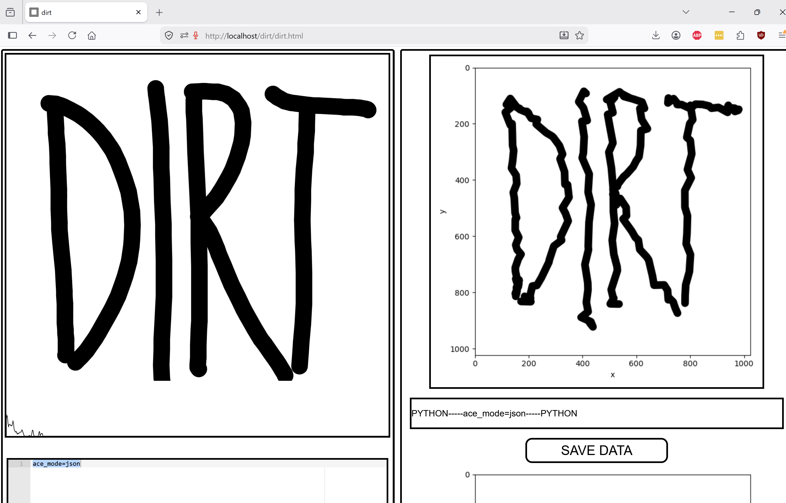

# [dirt](https://github.com/LafeLabs/dirt/)

Dirt connects the human body to Python using [p5.js](https://p5js.org/) and self-replicating, self-editing web code.  The system can evolve itself in a swarm of operators, servers, bots, and instruments. 


## [xampp for install on  windows or mac](https://www.apachefriends.org/download.html)

## [self-replicating php script](https://raw.githubusercontent.com/LafeLabs/dirt/refs/heads/main/replicate-file-set.php)


## Install code on linux:

```
sudo apt update
sudo apt install apache2 -y
sudo apt install php libapache2-mod-php -y
cd /var/www/html
sudo rm index.html
sudo apt-get install curl
sudo curl -o replicate-file-set.php https://raw.githubusercontent.com/LafeLabs/dirt/refs/heads/main/replicate-file-set.php
cd ..
sudo chmod -R 0777 *
cd html
php replicate-file-set.php
sudo chmod -R 0777 *
ln -s /var/www/html ~/Desktop/html
```
## python dependencies

 - [matplotlib](https://matplotlib.org/)
 - [numpy](https://numpy.org/)

## JavaScript Dependencies

 - [p5.js(human interface)](https://p5js.org/)
 - [ace.js(code syntax highlighting)](https://ace.c9.io/)
 - [showdown.js(markdown to html conversion)](https://github.com/showdownjs/showdown)
 - [mathjax.js(math typesetting)](https://www.mathjax.org/)
 - [qrcode.js(optional)](https://davidshimjs.github.io/qrcodejs/)
 - [p5.sound.js(browser sound input/output)](https://p5js.org/reference/p5.sound/)

## web files

 - [branch.html](branch.html)
 - [data.html](data.html)
 - [delete-files.html](delete-files.html)
 - [dirt.css](dirt.css)
 - [dirt.html](dirt.html)
 - [edit-files.html](edit-files.html)
 - [files.html](files.html)
 - [index.html](index.html)
 - [plots.html](plots.html)
 - [qrcode.html](qrcode.html)
 - [readme.html](readme.html)

## php files

 - [branch.php](branch.php)
 - [bridge.php](bridge.php)
 - [delete-branch.php](delete-branch.php)
 - [delete-file.php](delete-file.php)
 - [generate-file-set.php](generate-file-set.php)
 - [list-branches.php](list-branches.php)
 - [list-files.php](list-files.php)
 - [load-file.php](load-file.php)
 - [replicate-file-set.php](replicate-file-set.php)
 - [replicate-local-file-set.php](replicate-local-file-set.php)
 - [save-file-get.php](save-file-get.php)
 - [save-file.php](save-file.php)
 - [save-png.php](save-png.php)
 - [upload-image.php](upload-image.php)

## markdown files

 - [README.md](README.md)
 - [data.md](data.md)
 - [files.md](files.md)
 - [plots.md](plots.md)

## json files

 - [dirt.json](dirt.json)
 - [file-set.json](file-set.json)

## python files

 - [dirt.ipynb](dirt.ipynb)
 - [dirt.py](dirt.py)

## Screenshot



